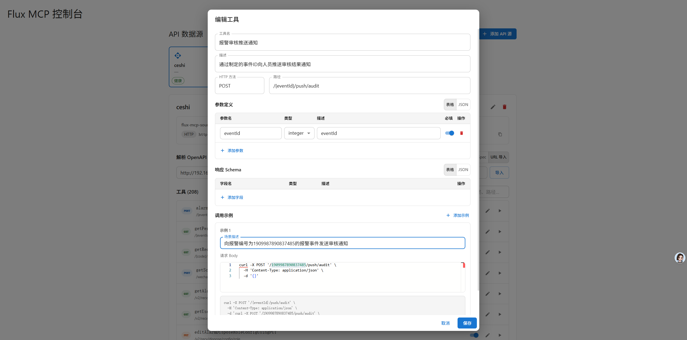

<p align="center">
  <h1 align="center">Flux MCP</h1>
  <p align="center"><strong>Turn any OpenAPI-described REST API into an MCP-compatible tool — zero code changes required.</strong></p>
</p>

<p align="center">
  <a href="README.zh-CN.md"></a>
  <a href="README.md"></a>
</p>

<p align="center">
  <a href="https://github.com/your-org/flux-mcp/actions"></a>
  <a href="LICENSE"></a>
  
  
  
  
</p>

---

Flux MCP is a standalone gateway that bridges HTTP REST APIs and the [Model Context Protocol (MCP)](https://modelcontextprotocol.io). Paste an OpenAPI/Swagger spec, and Flux MCP automatically converts every endpoint into an MCP tool that AI agents can discover and invoke — no API code changes needed.

## Features

- **OpenAPI to MCP** — Paste or fetch an OpenAPI 3.x / Swagger 2.0 spec; each operation becomes a callable MCP tool with full parameter schema.
- **Multi-source management** — Register multiple API sources with independent auth configs (API Key, Bearer Token, Basic Auth), toggle active/inactive per source.
- **Source-scoped MCP endpoints** — Each API source gets its own isolated MCP endpoint at `/api/v1/mcp/sources/{id}/mcp/message` with session isolation.
- **Built-in health monitoring** — Scheduled health checks with auto-deactivation on repeated failures, exponential backoff, and status tracking (HEALTHY / DEGRADED / UNREACHABLE).
- **Admin console** — React SPA with source CRUD, tool editing (Monaco JSON editor), live tool testing drawer, and connection-info copy-to-clipboard.
- **Session flexibility** — In-memory sessions by default (zero config), optional Redis (Redisson) for multi-instance deployments.
- **Security-first** — SSRF prevention, path traversal protection, configurable header passthrough blocklist, spec size limits.

## Screenshot

<p align="center">
  
</p>

## Quick Start

Get Flux MCP running in 3 steps with Docker Compose:

```bash
# 1. Clone the repository
git clone https://github.com/your-org/flux-mcp.git
cd flux-mcp

# 2. Copy and review the environment file
cp .env.example .env

# 3. Start everything (PostgreSQL + Redis + Flux MCP)
docker compose up --build
```

Open `http://localhost:8092` to access the admin console.

## Installation

### Docker Compose (Recommended)

```bash
docker compose up --build
```

This starts three services:
| Service | Image | Internal Port | External Port |
|---------|-------|---------------|---------------|
| PostgreSQL | `pgvector/pgvector:pg16` | 5432 | 5442 |
| Redis | `redis:7-alpine` | 6379 | 6399 |
| Flux MCP | Built from `Dockerfile` | 8092 | 8092 |

Database schema (`flux_mcp`) and migrations (Flyway) are applied automatically on startup.

### Build from Source

Prerequisites: Java 25, Maven 3.9+, PostgreSQL.

```bash
# Build the JAR
mvn -DskipTests package

# Run with a profile
java -jar target/flux-mcp-2.0.0.jar --spring.profiles.active=dev
```

### Frontend Development

```bash
cd frontend
npm install
npm run dev       # Vite dev server on :5174, proxies /api to backend
npm run build     # Production build
```

## Configuration

Flux MCP is configured via environment variables. Copy `.env.example` to get started:

```bash
cp .env.example .env
```

### Core Variables

| Variable | Default | Description |
|----------|---------|-------------|
| `FLUX_MCP_SERVER_PORT` | `8092` | HTTP server port |
| `FLUX_MCP_R2DBC_URL` | `r2dbc:postgresql://localhost:5442/ai_rag_platform?schema=flux_mcp` | Reactive DB connection (R2DBC) |
| `FLUX_MCP_JDBC_URL` | `jdbc:postgresql://localhost:5442/ai_rag_platform` | JDBC connection (used by Flyway) |
| `FLUX_MCP_DB_USERNAME` | `postgres` | Database username |
| `FLUX_MCP_DB_PASSWORD` | `123456` | Database password |

### Session Storage

| Variable | Default | Description |
|----------|---------|-------------|
| `FLUX_MCP_SESSION_STORE_TYPE` | `memory` | `memory` (single-instance) or `redis` (multi-instance) |
| `FLUX_MCP_SESSION_TTL` | `PT30M` | Session TTL (ISO 8601 duration) |
| `FLUX_MCP_SESSION_CLEANUP_INTERVAL` | `PT5M` | Cleanup interval |

Set `FLUX_MCP_SESSION_STORE_TYPE=redis` and configure these when using Redis:

| Variable | Default | Description |
|----------|---------|-------------|
| `FLUX_MCP_REDIS_HOST` | `localhost` | Redis host |
| `FLUX_MCP_REDIS_PORT` | `6379` | Redis port |
| `FLUX_MCP_REDIS_PASSWORD` | _(empty)_ | Redis password |

### Health Monitoring

| Variable | Default | Description |
|----------|---------|-------------|
| `FLUX_MCP_HEALTH_ENABLED` | `true` | Enable scheduled health checks |
| `FLUX_MCP_HEALTH_INTERVAL` | `PT60S` | Check interval |
| `FLUX_MCP_HEALTH_TIMEOUT` | `PT5S` | Probe timeout |
| `FLUX_MCP_HEALTH_SLOW_THRESHOLD` | `PT3S` | Threshold to mark as DEGRADED |
| `FLUX_MCP_HEALTH_MAX_FAILURES` | `5` | Consecutive failures before auto-deactivate |
| `FLUX_MCP_HEALTH_AUTO_DEACTIVATE` | `true` | Auto-deactivate unreachable sources |
| `FLUX_MCP_HEALTH_CONCURRENCY` | `5` | Max concurrent probes |

### MCP Transport

| Variable | Default | Description |
|----------|---------|-------------|
| `FLUX_MCP_SSE_PATH` | `/sse` | SSE endpoint path |
| `FLUX_MCP_STREAMABLE_HTTP_PATH` | `/mcp/message` | Streamable HTTP endpoint path |

## Architecture

Flux MCP follows **Hexagonal Architecture** (Ports & Adapters):

```
interfaces/        REST controller + DTOs (inbound adapters)
application/       Application service (orchestration)
domain/            Core models, domain services, port interfaces
infrastructure/    R2DBC repos, HTTP client, OpenAPI parser, MCP server, Redis (outbound adapters)
```

Key components:
- **DynamicApiToolCallbackProvider** — Dynamically registers MCP tools from parsed OpenAPI operations.
- **SourceScopedMcpServerRegistry** — Creates isolated MCP server instances per API source.
- **SwaggerOpenApiParser** — Parses OpenAPI 3.x and Swagger 2.0 with automatic detection.
- **McpHealthCheckScheduler** — Periodic health probing with status transition logic.

## REST API Reference

Base path: `/api/v1/mcp`

| Method | Endpoint | Description |
|--------|----------|-------------|
| `GET` | `/sources` | List all API sources |
| `POST` | `/sources` | Create a new API source |
| `GET` | `/sources/{id}` | Get source details |
| `PUT` | `/sources/{id}` | Update source |
| `DELETE` | `/sources/{id}` | Delete source |
| `PATCH` | `/sources/{id}/toggle-active` | Toggle active state |
| `GET` | `/sources/health` | List health status for all sources |
| `POST` | `/sources/{id}/health-check` | Trigger manual health check |
| `POST` | `/sources/{id}/parse` | Parse OpenAPI spec into tools |
| `GET` | `/sources/{id}/tools` | List tools for a source |
| `PUT` | `/tools/{id}` | Update a tool mapping |
| `POST` | `/tools/{id}/test` | Test-invoke a tool |
| `GET` | `/connection-info` | Get MCP connection info |
| `GET` | `/sources/{id}/connection-info` | Get source-specific connection info |

## License

This project is licensed under the [MIT License](LICENSE).